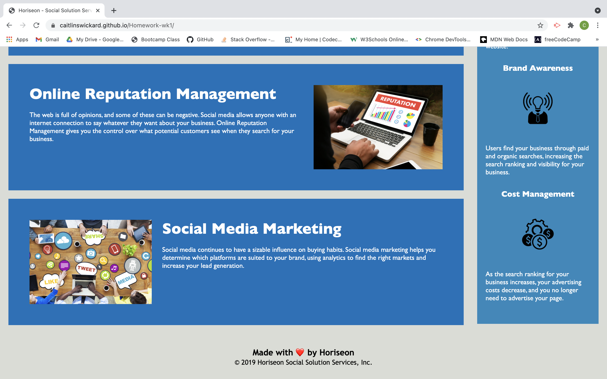

## Modified

- Update to Horiseon website to assure that all codebase follows web accessibility standards.
- Update to head data order as well as new title for page.
- Clean up of all code formatting and semantic HTML.
- Attached alt attributes to necessary photos.
- Condensed css code by combining classes.
- Fixed header links to location on page.

### Screen shots

Below are screen shots that show finished webpage on GitHub repo up and running:

